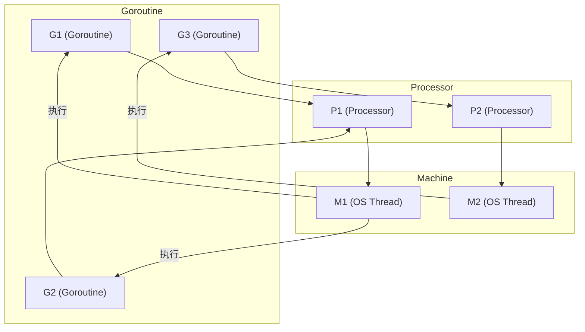

# Go语言特性

​                                                                                                                                         **创建时间**: 2025年6月15日 22:54

## Go语言基础

### 1. 介绍一下Go语言的特点和优势

- 语法简单
- 支持轻量级线程（goroutine）和通信管道（channel），实现高效并发与通信
- 内置自动垃圾回收机制

---

### 2. Go和Java对比

1. Java使用广泛，但Go更适合高并发和轻量级应用。
2. Java通过线程和锁机制处理并发，Go的核心是Goroutine和Channel。
3. Java功能丰富，支持面向对象和泛型，Go注重简洁和可读性。
4. 两者都有垃圾回收机制，但实现细节不同。
5. Go适合高性能后端、云服务，Java适合大型企业应用。

---

### 3. Go string和[]byte的区别

- **不可变性**：string不可变，[]byte可变。
- **类型转换**：可互转，互不影响。
- **内存分配**：string只读，[]byte可修改。
- **Unicode支持**：string按字符，[]byte按字节。

---

### 4. make和new的区别

- **make**：用于slice、map、channel，返回初始化后的引用类型。
- **new**：分配值类型内存，返回指针。

```go
slice := make([]int, 5, 10)
ptr := new(int)
```

---

### 5. 数组和切片的区别

- **数组**：固定长度，值类型，内存连续。
- **切片**：动态长度，引用类型，底层数组可扩展。

---

### 6. 切片扩容机制

- 小切片扩容通常为2倍，大切片按1/4递增。
- 可能会分配新数组并拷贝数据。

---

### 7. 扩容前后的Slice是一样的吗？

- 若原地扩容则相同，否则分配新数组，引用不同。

---

### 8. Go Slice的底层实现

```go
type slice struct {
    array unsafe.Pointer // 指向底层数组
    len   int            // 当前长度
    cap   int            // 容量
}
```

---

### 9. Go语言参数传递

- 基本类型和值类型：传值。
- 引用类型（slice、map、channel）：传引用副本。

---

### 10. Go语言map是有序的还是无序的？为什么？

- **map是无序的**，底层采用哈希表实现。

---

### 11. Go map 的底层实现

- 基于哈希表，存储桶bucket，处理哈希冲突。

---

### 12. map如何扩容

- 元素数量达到阈值时自动扩容，分配新桶并重新哈希。

---

### 13. 如何按照特定顺序遍历map

1. 键存入切片
2. 排序
3. 按序遍历

```go
var keys []string
for k := range myMap {
    keys = append(keys, k)
}
sort.Strings(keys)
for _, k := range keys {
    fmt.Println(k, myMap[k])
}
```

---

### 14. Go的map是并发安全的吗？如何安全并发

- 标准map非并发安全。
- 用sync.Map实现并发安全。

```go
import "sync"

var myMap sync.Map

go func() {
    myMap.Store("key", "value")
    if value, ok := myMap.Load("key"); ok {
        // 处理 value
    }
}()
```

---

### 15. Go的错误处理和Java的异常处理对比

- Go用error返回值，Java用try-catch。

---

### 16. Go有异常类型吗

- 主要用error，panic和recover实现异常处理。

```go
result, err := someFunction()
if err != nil {
    // 处理错误
}
```

```go
func example() {
    defer func() {
        if r := recover(); r != nil {
            fmt.Println("Recovered:", r)
        }
    }()
    panic("Something went wrong!")
}

func main() {
    example()
}
```

---

### 17. 介绍一下panic和recover

- panic用于引发运行时错误，recover用于捕获并处理panic。

---

### 18. 什么是defer？ 有什么作用

- defer用于延迟执行，常用于资源释放。

---

### 19. Go面向对象是怎么实现的？

- 通过struct和interface实现组合和多态。
- 首字母控制可见性。

```go
type Person struct {
    Name string
    Age  int
}

func (p *Person) SayHello() {
    fmt.Println("Hello, my name is", p.Name)
}

// 接口
type Speaker interface {
    Speak()
}

type Person2 struct {
    Name string
}
//实现接口方法，隐式集成Speaker
func (p *Person2) Speak() {
    fmt.Println("Hello, my name is", p.Name)
}
```

---

## GO并发
### 进程、线程、协程

- **进程（Process）**：操作系统资源分配的基本单位，每个进程有独立的内存空间。
- **线程（Thread）**：CPU 调度的基本单位，同一进程下的线程共享内存空间。
- **协程（Coroutine）**：用户态的轻量级线程，由程序自身调度，切换开销小，Go 的 goroutine 就是协程。

---

### 进程、线程的区别

- 进程间相互独立，线程间共享进程资源。
- 进程切换开销大，线程切换开销小。
- 线程更适合需要频繁切换和共享数据的场景。

---

### 协程和线程的区别

- 协程由用户态调度，线程由内核调度。
- 协程切换无需陷入内核，开销更小。
- 协程适合高并发、I/O 密集型场景。

---

### 并行和并发的区别

- **并发（Concurrency）**：同一时间段内多个任务交替进行，宏观上"同时"执行。
- **并行（Parallelism）**：多个任务在同一时刻真正同时执行（多核 CPU）。

---

### Go语言并发模型

Go 采用 CSP（Communicating Sequential Processes）并发模型，核心是 goroutine 和 channel。
- goroutine 负责并发执行任务。
- channel 用于 goroutine 之间通信。

---

### 什么是 goroutine

goroutine 是 Go 运行时管理的轻量级线程，创建方式简单，资源消耗极低。

```go
go func() {
    fmt.Println("Hello from goroutine")
}()
```

---

### 如何控制 goroutine 的生命周期

在 Go 语言中，合理控制 goroutine 的生命周期非常重要，否则容易导致 goroutine 泄漏、资源浪费等问题。常见的控制方法有：

#### 1. 使用 sync.WaitGroup 等待所有 goroutine 结束

`sync.WaitGroup` 用于等待一组 goroutine 执行完成。

```go
var wg sync.WaitGroup
for i := 0; i < 3; i++ {
    wg.Add(1)
    go func(id int) {
        defer wg.Done()
        fmt.Println("goroutine", id, "done")
    }(i)
}
wg.Wait() // 等待所有 goroutine 结束
```

#### 2. 使用 context 控制 goroutine 的取消和超时

`context.Context` 可以实现 goroutine 的主动取消、超时控制和传递信号。

```go
ctx, cancel := context.WithCancel(context.Background())
go func() {
    for {
        select {
            case <-ctx.Done():
            fmt.Println("goroutine exit")
            return
            default:
            // do work
            fmt.Println("goroutine working...")
            time.Sleep(time.Second)
        }
    }
}()
time.Sleep(3 * time.Second)
cancel() // 通知 goroutine 退出
time.Sleep(time.Second)
fmt.Println("main exit")
```

#### 3. 通过关闭 channel 通知 goroutine 退出

```go
var wg sync.WaitGroup
	//创建外层context
	parentCtx, parentCancel := context.WithCancel(context.Background())

	wg.Add(1)
	go func() {
		defer wg.Done()
		for {
			select {
			case <-parentCtx.Done():
				fmt.Println("outer goroutine exit")
				return
			default:
				//创建子context
				childCtx, childCancel := context.WithCancel(context.Background())
				go func(ctx context.Context) {
					for {
						select {
						case <-ctx.Done():
							fmt.Println("child goroutine exit")
							return
						default:
							fmt.Println("child  goroutine working...")
							time.Sleep(time.Second)
						}
					}
				}(childCtx)

				time.Sleep(3 * time.Second)
				childCancel()
				time.Sleep(time.Second)
				fmt.Println("main exit")
			}
		}
	}()

	time.Sleep(10 * time.Second)
	parentCancel()
	wg.Wait()
	fmt.Println("main end")
```

#### 4. 设置超时/定时器自动退出

```go
func main() {
	timeout := time.After(2 * time.Second)
	go func() {
		for {
			select {
			case <-timeout:
				fmt.Println("goroutine timeout exit")
				return
			default:
				// do work
				fmt.Println("goroutine working")
				time.Sleep(500 * time.Millisecond) // 给 CPU 一点喘息时间
			}
		}
	}()
	time.Sleep(3 * time.Second) // 等待 goroutine 运行完
}
```

#### 5. 注意事项
- goroutine 内部应有退出条件，避免死循环。
- 推荐用 context 统一管理 goroutine 生命周期，便于资源回收和协作。
- 及时关闭 channel，防止 goroutine 永久阻塞。

---

### Go语言中的 Channel 是什么，有哪些用途，如何处理阻塞

- **Channel** 是 goroutine 之间通信的管道，类型安全。
- 用途：数据传递、同步、信号通知等。
- 阻塞：发送和接收操作默认会阻塞，直到另一端准备好。

```go
ch := make(chan int)
go func() {
    ch <- 42 // 阻塞直到有接收者
}()
fmt.Println(<-ch) // 阻塞直到有发送者
```

---

### 什么是互斥锁（mutex）？在什么情况下会用到它们？详细解释与代码示例

#### 详细解释

互斥锁（mutex, mutual exclusion lock）是一种用于多线程/多 goroutine 并发编程的同步原语。它的作用是保证同一时刻只有一个 goroutine 能进入临界区（即访问共享资源的代码块），从而防止数据竞争和并发安全问题。

**典型应用场景：**
- 多个 goroutine 需要对同一个变量、map、切片等进行写操作时。
- 计数器累加、全局状态修改等。

**原理：**
- 加锁（Lock）：获得互斥锁，进入临界区。如果锁已被其他 goroutine 占用，则当前 goroutine 会阻塞等待。
- 解锁（Unlock）：释放互斥锁，允许其他等待的 goroutine 进入临界区。

#### 代码 Demo

```go
package main

import (
    "fmt"
    "sync"
)

func main() {
    var mu sync.Mutex
    counter := 0

    var wg sync.WaitGroup
    for i := 0; i < 5; i++ {
        wg.Add(1)
        go func() {
            defer wg.Done()
            mu.Lock()         // 加锁，进入临界区
            counter++
            mu.Unlock()       // 解锁，离开临界区
        }()
    }
    wg.Wait()
    fmt.Println("Final counter:", counter)
}
```

---

### Mutex有几种模式 详细解释与代码示例

#### 详细解释

- `sync.Mutex`：Go 标准库中的互斥锁，只有"加锁/解锁"两种操作，不区分读写。
- `sync.RWMutex`：读写互斥锁，支持两种模式：
  - 读锁（RLock）：允许多个 goroutine 同时读取，但不能写。
  - 写锁（Lock）：只允许一个 goroutine 写，写时不能有其他读或写。

**适用场景：**
- **读多写少**时，使用 `sync.RWMutex` 可以提升并发性能。

| 操作类型              | 是否并发             | 是否阻塞其他       |
| --------------------- | -------------------- | ------------------ |
| `RLock`               | ✅ 支持并发读         | ❌ 不会阻塞其他读   |
| `Lock`                | ❌ 不支持并发写       | ✅ 阻塞其他读和写   |
| `RLock` + `Lock` 混用 | ✅ 等待读锁释放才能写 | ✅ 写期间阻止其他读 |

#### 代码 Demo

```go
package main

import (
    "fmt"
    "sync"
    "time"
)

func main() {
    var rw sync.RWMutex
    data := 0

    // 启动多个读 goroutine
    for i := 0; i < 3; i++ {
        go func(id int) {
            rw.RLock()
            fmt.Printf("Goroutine %d read data: %d\n", id, data)
            time.Sleep(100 * time.Millisecond)
            rw.RUnlock()
        }(i)
    }

    // 启动一个写 goroutine
    go func() {
        rw.Lock()
        data = 42
        fmt.Println("Write goroutine updated data to 42")
        time.Sleep(200 * time.Millisecond)
        rw.Unlock()
    }()

    time.Sleep(500 * time.Millisecond)
}
```

---

### Mutex有几种状态 详细解释与代码示例

#### 详细解释

- **未加锁（Unlocked）**：互斥锁处于空闲状态，任何 goroutine 都可以获取锁。
- **已加锁（Locked）**：互斥锁已被某个 goroutine 持有，其他 goroutine 只能等待。

**注意事项：**
- 如果重复加锁（同一个 goroutine 未解锁前再次加锁），会导致死锁。
- 解锁时必须保证当前 goroutine 已持有锁，否则会 panic。

#### 代码 Demo

```go
package main

import (
    "fmt"
    "sync"
)

func main() {
    var mu sync.Mutex

    mu.Lock()   // 加锁，状态变为已加锁
    fmt.Println("Locked the mutex")

    mu.Unlock() // 解锁，状态变为未加锁
    fmt.Println("Unlocked the mutex")
}
```

---

### 无缓冲的 channel 和有缓冲的 channel 的区别？

- **无缓冲 channel**：发送和接收必须同步进行。
- **有缓冲 channel**：发送操作在缓冲区未满时不会阻塞，接收操作在缓冲区非空时不会阻塞。

```go
ch := make(chan int)      // 无缓冲
ch2 := make(chan int, 10) // 有缓冲
```

---

### Go什么时候发生阻塞？阻塞时调度器会怎么做

- goroutine 在等待 channel、锁、I/O、select 等操作时会阻塞。
- 阻塞时，调度器会将当前 goroutine 挂起，调度其他可运行的 goroutine。

---

### goroutine什么情况会发生内存泄漏？如何避免

- goroutine 长时间阻塞且无法退出（如 channel 永远没有数据、死锁等）会导致内存泄漏。
- 避免方法：合理设计 goroutine 生命周期，使用 context、关闭 channel、select 超时等手段及时退出。

---

### go的垃圾回收机制了解吗

Go 使用三色标记-清除（Mark-Sweep）垃圾回收算法，自动管理内存。
- 标记阶段：遍历所有可达对象并标记。
- 清除阶段：回收未被标记的对象。
- 并发回收，减少 STW（Stop The World）时间。

---

### Go语言中GC的流程是什么

1. 标记根对象（全局变量、栈上的引用等）。
2. 遍历引用链，标记所有可达对象。
3. 清除未被标记的对象，释放内存。
4. 并发与增量回收，减少对程序运行的影响。

---

### GC如何调优

- 合理设置 GOGC 环境变量（默认 100，表示内存增长 100% 时触发 GC）。
- 避免频繁分配和释放大对象。
- 优化数据结构，减少内存碎片。
- 使用 runtime.ReadMemStats 监控内存和 GC 状态。

---

### GMP协程调度模型详细解释
好的，下面我将参考 Go 官方文档（[go.dev/doc/](https://go.dev/doc/)），对你笔记中"GMP协程调度模型详细解释"部分进行详细、准确、逻辑清晰的解释，并给出代码 demo 和流程图代码。

#### 一、GMP模型简介

Go 语言的并发调度模型采用 GMP（Goroutine、Machine、Processor）架构。  
- **G（Goroutine）**：代表 Go 协程，是 Go 运行时调度的最小单元。
- **M（Machine）**：代表操作系统线程（OS Thread），负责真正执行代码。
- **P（Processor）**：代表调度器中的处理器，管理可运行的 G 队列和资源，决定 M 能否执行 G。

GMP 的关系如下：
- G 由 P 调度，P 绑定到 M 上，M 负责执行 G。
- P 的数量由 GOMAXPROCS 决定，P 负责调度和分配 G 到 M。
- M 负责实际运行 G，M 的数量可以大于 P，但只有获得 P 的 M 才能执行 G。

#### 二、GMP模型运行流程

1. **Goroutine 创建**：当你用 `go func()` 创建一个 goroutine 时，Go 运行时会创建一个 G，并将其放入某个 P 的本地队列。
2. **P 负责调度**：P 维护一个本地 G 队列，负责从队列中取出 G，分配给绑定的 M 执行。
3. **M 负责执行**：M 获取到 P 后，从 P 的队列中取出 G 并执行。M 运行完一个 G 后会继续取下一个 G。
4. **调度与抢占**：如果 P 的本地队列为空，会尝试从其他 P 的队列"窃取"G，保证负载均衡。
5. **系统调用阻塞处理**：如果 M 因系统调用阻塞，P 会解绑并绑定到其他空闲 M，保证不会因为阻塞而影响调度。

#### 三、GMP模型流程图



#### 四、代码 Demo

以下代码演示了 Go 的并发调度，多个 goroutine 并发执行，GMP 模型在底层自动调度：

```go
package main

import (
    "fmt"
    "runtime"
    "sync"
)

func main() {
    runtime.GOMAXPROCS(2) // 设置最大P的数量为2
    var wg sync.WaitGroup
    for i := 0; i < 5; i++ {
        wg.Add(1)
        go func(id int) {
            defer wg.Done()
            fmt.Printf("Goroutine %d running on thread %d\n", id, getGoroutineThreadID())
        }(i)
    }
    wg.Wait()
}

// 获取当前线程ID（仅用于演示，非官方API）
func getGoroutineThreadID() int {
    return syscall.Gettid()
}
```
> 注意：`syscall.Gettid()` 仅在 Linux 下有效，Windows 下可用 `GetCurrentThreadId`，这里只是演示 goroutine 运行在不同线程上。

#### 五、GMP模型的优势

- **高并发**：Goroutine 数量远大于线程数，调度高效。
- **资源复用**：P 控制 M 的数量，避免线程过多带来的资源浪费。
- **负载均衡**：P 之间可窃取任务，保证各 P 负载均衡。
- **阻塞隔离**：M 阻塞时，P 可切换到其他 M，避免调度阻塞。

#### 六、官方文档参考

- [Go 并发调度原理（Effective Go）](https://go.dev/doc/effective_go#concurrency)
- [Go runtime 源码解读（Go Blog）](https://go.dev/blog/)

---

如需更深入的源码分析或调度细节，可参考 Go 官方文档和 runtime 包源码：[Go Documentation](https://go.dev/doc/)。
### Go 中的内存逃逸现象是什么？

**内存逃逸**是指本应分配在栈上的变量，由于其作用域超出了当前函数，被 Go 编译器自动分配到堆上。

**常见原因：**
- 返回局部变量的指针
- 闭包引用了外部变量
- interface、slice等类型的底层数据被外部引用

**示例：**
```go
func foo() *int {
    a := 10
    return &a // a 发生逃逸，分配到堆上
}
```

**检测方法：**
使用 `go build -gcflags '-m'` 查看逃逸分析。

---

### CAP 理论，为什么不能同时满足

**CAP理论**指出：在分布式系统中，无法同时满足以下三点：
- 一致性（Consistency）：所有节点在同一时间的数据一致
- 可用性（Availability）：每个请求都能在有限时间内返回结果
- 分区容忍性（Partition tolerance）：系统能容忍网络分区故障

**原因：**
当网络分区发生时（P），系统只能在一致性（C）和可用性（A）之间二选一。
- 保证一致性：部分节点需拒绝请求，牺牲可用性
- 保证可用性：允许节点返回旧数据，牺牲一致性

---

## Go Web

### 你有使用过哪些Go的Web框架？介绍一下它们。

- **Gin**：高性能、API 友好的 Web 框架，路由灵活，支持中间件，文档丰富。
- **Beego**：全栈 Web 框架，内置 ORM、缓存、定时任务等，适合大型项目。
- **Echo**：极简、快速，API 设计清晰，支持中间件链式调用。
- **Fiber**：受 Express 启发，极致性能，API 友好，适合高并发场景。

---

### 说一下 Gin 的拦截器的原理

Gin 的拦截器本质是**中间件（Middleware）**，通过链式调用实现请求前后处理。
- 每个中间件是一个 `func(c *gin.Context)`，可在请求前后执行逻辑。
- 通过 `c.Next()` 控制是否继续执行后续中间件和处理函数。

**示例：**
```go
func Logger() gin.HandlerFunc {
    return func(c *gin.Context) {
        t := time.Now()
        c.Next()
        latency := time.Since(t)
        log.Print(latency)
    }
}
r := gin.Default()
r.Use(Logger())
```

---

### 说一下 Gin 的路由怎么实现的

Gin 路由基于**前缀树（Trie）**实现，支持静态路由、参数路由、通配符路由。
- 路由注册时，路径被拆分为节点插入前缀树。
- 请求到来时，按路径逐级匹配节点，查找对应的处理函数。

**示例：**
```go
r := gin.Default()
r.GET("/user/:id", func(c *gin.Context) {
    id := c.Param("id")
    c.String(200, "User ID: %s", id)
})
```

---

### Go中的context包作用
- 用于在goroutine间传递上下文信息，实现超时、取消、传值等。
- context的作用就是在不同的goroutine之间同步请求特定的数据、取消信号以及处理请求的截止日期。

[小白也能看懂context原理](https://link.zhihu.com/?target=https%3A//cloud.tencent.com/developer/article/1900658)

（此部分可继续补充）