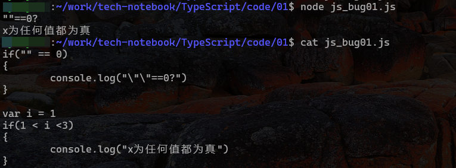

# 前言

TS是JS的超集，所以JS基础的类型都包含在内。

起初JS只是作为浏览器的脚本语言，在Nodejs的出现后，让JS可运行在浏览器之外，JS被大量应用，但其设计较为简陋，存在诸多问题，比如

- JavaScript 的等于运算符（`==`）会试图 *强制* 值相等，导致一些意外行为

```js
if ("" == 0) {
  // 他们相等！但是为什么呢？？
}
if (1 < x < 3) {
  // x是 *任何* 值都为真！
}
```



所以出现了JavaScript 的类型化超集——typescript

# 安装

[Node.js — 下载 Node.js®](https://nodejs.org/zh-cn/download)

```bash
# 下载并安装 nvm：
curl -o- https://raw.githubusercontent.com/nvm-sh/nvm/v0.40.3/install.sh | bash

# 代替重启 shell
\. "$HOME/.nvm/nvm.sh"

# 下载并安装 Node.js：
nvm install 24

# 验证 Node.js 版本：
node -v # Should print "v24.18.1".

# 验证 npm 版本：
npm -v # Should print "11.16.0".

# 设置淘宝源
npm config set registry https://registry.npmmirror.com

# 全局安装正确的typescript
npm install typescript -g
```

# tsconfig.jon

```json
{
  "compilerOptions": {
    // ========== 1. 编译输出目录（代码分类整洁） ==========
    "rootDir": "./",
    "outDir": "./dist",

    // ========== 2. 运行环境适配 Node.js ==========
    // nodenext：Node 标准 ES Module / CommonJS 自动识别
    "module": "nodenext",
    // target：编译输出 JS 版本，node 高版本直接 esnext
    "target": "ES2020",
    // 内置语法库，只保留 ES 标准，不需要浏览器 DOM API
    "lib": ["ES2020"],
    // 加载 node 内置 API 类型（必须安装 @types/node）
    "types": ["node"],

    // ========== 3. 初学关闭多余文件产物 ==========
    "sourceMap": false,
    "declaration": false,
    "declarationMap": false,

    // ========== 4. 核心：严格类型检查（学习必开！） ==========
    "strict": true,
    // 索引签名严格校验，避免数组/对象取值 undefined 坑
    "noUncheckedIndexedAccess": true,
    // 可选属性严格区分 undefined 和 空值
    "exactOptionalPropertyTypes": true,

    // ========== 5. 代码规范校验，杜绝劣质代码 ==========
    // 函数必须有显式 return
    "noImplicitReturns": true,
    // 未使用局部变量直接报错，及时清理冗余代码
    "noUnusedLocals": true,
    // 未使用函数参数报错
    "noUnusedParameters": true,
    // switch 不加 break 直接报错，防止穿透bug
    "noFallthroughCasesInSwitch": true,

    // ========== 6. 模块化、编译优化配置 ==========
    // 导入导出语法严格，不能混用默认导出
    "verbatimModuleSyntax": true,
    // 每个文件可单独编译，兼容性更好
    "isolatedModules": true,
    // 跳过第三方类型库检查，加快编译速度
    "skipLibCheck": true,
    // 自动识别文件模块类型
    "moduleDetection": "force",
    // 无副作用导入报错，避免隐形执行代码
    "noUncheckedSideEffectImports": true
  },

  // ========== 编译范围控制 ==========
  // 编译当前目录所有 ts/tsx 文件
  "include": ["**/*.ts"],
  // 排除 node_modules、编译输出文件夹
  "exclude": ["node_modules", "dist"]
}
```

配置里依赖 node 类型定义，先安装开发依赖：

```bash
npm init -y
npm install -D @types/node typescript
```

## 常用学习编译命令

1. 一次性编译所有 TS 文件

```BASH
tsc
```

读取 `include: ["./src/*.ts"]`，src 下所有 ts 编译输出到 `dist/`。

2. 自动监听编译

```BASH
tsc --watch
# 简写
tsc -w
# 修改 src 内任意 ts 文件，立刻重新编译，终端实时提示错误。
```

3. 单次编译单个文件（需忽略tsconfig配置）

```bash
tsc src/null.ts --ignoreConfig
```

4. 清空旧产物&重新编译

```bash
# 删除dist，再重新编译
rm -rf dist && tsc
```

5. 查看当前生效完整tsconfig配置

```bash
tsc --showconfig
```

6. 只做类型检查，不生成JS文件

```bash
tsc --noEmit
```

7. 生成全新的tsconfig.json

```bash
rm tsconfig.json
tsc --init
```

# 基础语法

## 1.字符串类型

```typescript
// 普通声明
let  a: string  = '123'
// ES6字符串模板
let str: string = `dddd${a}`

log.console(a,str)
```

## 2.数字类型

```typescript
let notANumber: number = NaN;//Nan
let num: number = 123;//普通数字
let infinityNumber: number = Infinity;//无穷大
let decimal: number = 6;//十进制
let hex: number = 0xf00d;//十六进制
let binary: number = 0b1010;//二进制
let octal: number = 0o744;//八进制s
```

## 3.布尔类型

```ts
let Boolean01 : Boolean = new Boolean(1) // 返回的对象是Boolean
let boolean02 : boolean = true
let boolean03 : boolean = Boolean(1)
```

## 4.空值类型

js没有空值（void）的概念，在Typescript中，可以用void表示没有任何返回值的函数

```ts
function voidFn(): void {
    console.log('test void')
}
```

void类型主要是在我们不希望调用者关心函数返回值的情况，比如通常的异步回调函数void也可以定义undefined和null类型。

## 5.Null、undefined、Void类型的最大区别

- `undefined` 和 `null` 是所有类型的子类型,可以赋值给类似string类型的变量
- 详细对比[null、undefined、void类型的区别.md](./null、undefined、void类型的区别.md)

```ts
//这样写会报错 void类型不可以分给其他类型
let test: void = undefined
let num2: string = "1"
 
num2 = test

//这样是没问题的
let test: null = null
let num2: string = "1"
 
num2 = test
 
//或者这样的
let test: undefined = undefined
let num2: string = "1"
 
num2 = test
```

## TIPS 注意

如果你配置了tsconfig.json  开启了严格模式 脚本语言
    "compilerOptions":{
        "strict": true
    }

 **null 是不能 赋予 void 类型** 

## 6.任意类型Any和unkown

1. 不强制限定那种类型，随时切换任何类型都可以，不需要检查类型

```ts
let anys:any = 123
anys = '123'

console.log(anys)

anys = true

console.log(anys)
```

2. 声明变量时不指定类型，默认any

```ts
let anys2;
console.log(anys2)

anys2 = 123

console.log(anys2)

anys2 = '123'

console.log(anys2)
```

3. 如果使用any，从一定程度上来说就没有了ts退化为js

4. .TypeScript 3.0中引入的 unknown 类型也被认为是 top type ，但它更安全。与 any 一样，所有类型都可以分配给unknown，unknow unknow类型比any更加严格当你要使用any 的时候可以尝试使用unknow。

   ```TypeScript
   //unknown 可以定义任何类型的值
   let value: unknown;
    
   value = true;             // OK
   value = 42;               // OK
   value = "Hello World";    // OK
   value = [];               // OK
   value = {};               // OK
   value = null;             // OK
   value = undefined;        // OK
   value = Symbol("type");   // OK
    
   //这样写会报错unknow类型不能作为子类型只能作为父类型 any可以作为父类型和子类型
   //unknown类型不能赋值给其他类型
   let names1:unknown = '123'
   let names2:string = names1
    
   //这样就没问题 any类型是可以的
   let names3:any = '123'
   let names4:string = names3   
    
   //unknown可赋值对象只有unknown 和 any
   let bbb:unknown = '123'
   let aaa:any= '456'
    
   aaa = bbb
   
   
   // 如果是any类型在对象没有这个属性的时候还在获取是不会报错的
   let obj1:any = {b:1}
   obj1.a
    
    
   // 如果是unknow 是不能调用属性和方法
   let obj2:unknown = {b:1,ccc:():number=>213}
   obj2.b
   obj2.ccc()
   ```

## 7.接口和对象类型

- 在ts中，定义对象的使用`interface`，定义方式如下
- 可选属性使用`?`操作符
- **一旦定义了任意属性，那么确定属性和可选属性的类型都必须是它的类型的子集**
- 只读属性 readonly，不允许被赋值的只能读取
- 支持添加方法属性

```ts
//这样写是会报错的 因为我们在person定义了a，b但是对象里面缺少b属性
//使用接口约束的时候不能多一个属性也不能少一个属性
//必须与接口保持一致
interface Person {
    b:string,
    a:string
}
 
const person:Person  = {
    a:"213"
}

// 合并
interface A1{name:string}
interface A1{age:number}


var x:A1={name:'xx',age:20}

// 继承
interface A2{
    name:string
}

interface B1 extends A2{
    age:number
}
 
let obj:B1 = {
    age:18,
    name:"string"
}

// 可选属性
// 含义是该属性可以不存在
// 所以说这样写也是没问题的
interface Person1 {
    b1?:string,
    a1:string
}
 
const person1:Person1  = {
    a1:"213"
}

//在这个例子当中我们看到接口中并没有定义C但是并没有报错
//应为我们定义了[propName: string]: any;
//允许添加新的任意属性
interface Person2 {
    b2?:string,
    a2:string,
    [propName: string]: any;
}
 
const person2:Person2  = {
    a2:"213",
    c2:"123"
}

//这样写是会报错的
//应为a是只读的不允许重新赋值
interface Person3 {
    b3?: string,
    readonly a3: string,
    [propName: string]: any;
}
 
const person3: Person3 = {
    a3: "213",
    c3: "123"
}
 
person3.a3 = 123

// 添加方法属性
interface Person4 {
    b4?: string,
    readonly a4: string,
    [propName: string]: any;
    cb:()=>void
}
 
const person4: Person4 = {
    a4: "213",
    c4: "123",
    cb:()=>{
        console.log(123)
    }
}
```

## 8.数组类型


