# 1 引言

在电路设计中，电容是最常用的被动元件之一。但很多初学者都有一个误区：只要容值一样，电容的效果就应该一样。

但实际有许多不同类型的电容，常见的有陶瓷电容、电解电容、薄膜电容。

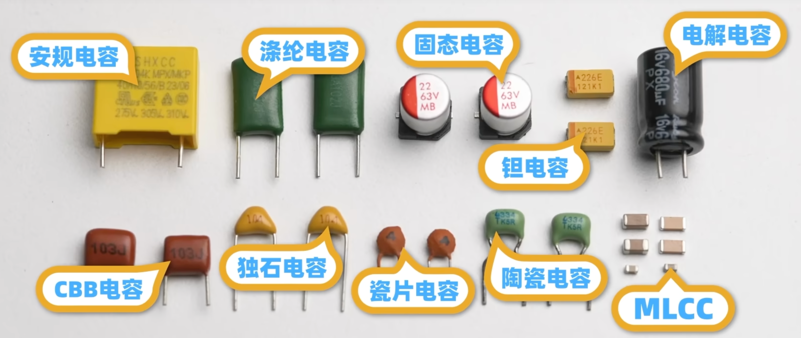

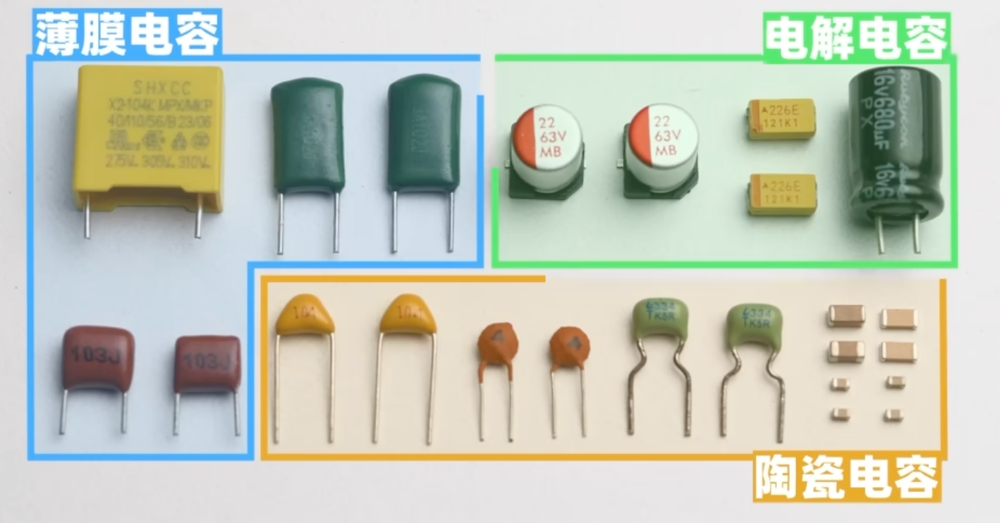

# 2 陶瓷电容

## 2.1 瓷片电容

最初是一个电极板夹着一个电介质

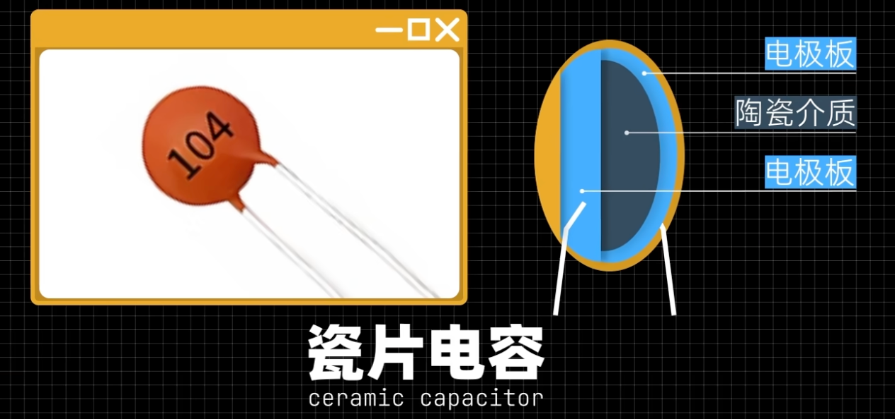

## 2.2 多层陶瓷电容（MLCC）

由多层的极板构成，所以多层的陶瓷电容要比单层的陶瓷电容的容值范围要大。

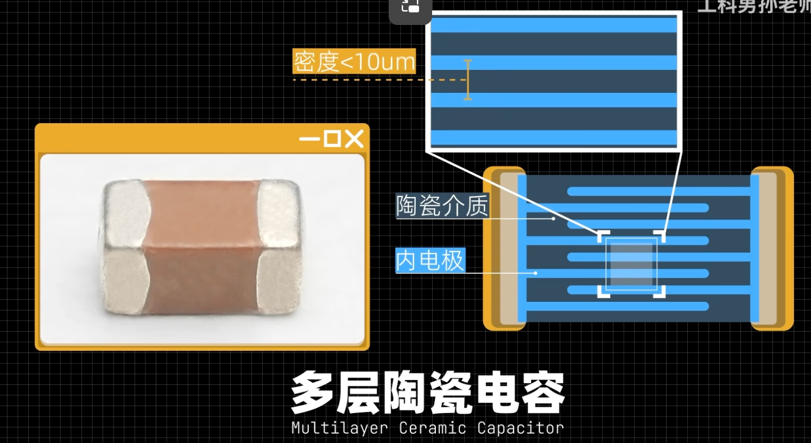

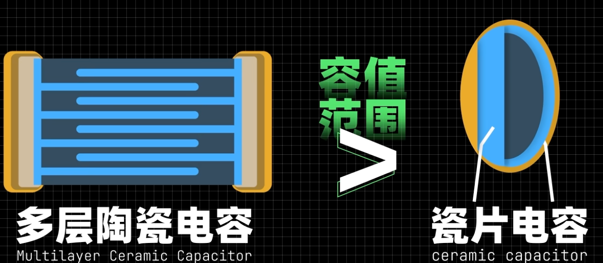

如果你的电路需要容值<22uF，且耐压<50V都可以选用这个电容

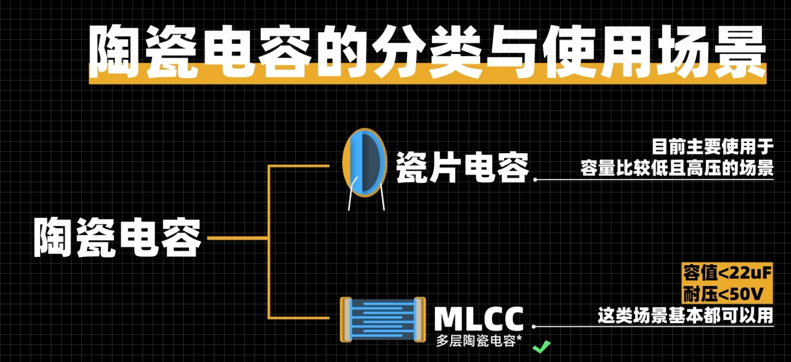

# 3 电解电容

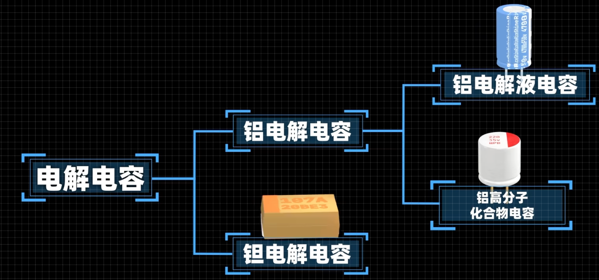

一般情况下MLCC的容值**<= 47uF**，否则可能需要考虑使用电解电容

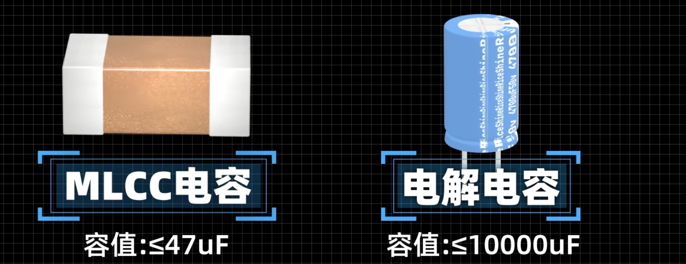

### 3.1 主要作用

- 电源的滤波

- 全桥整流

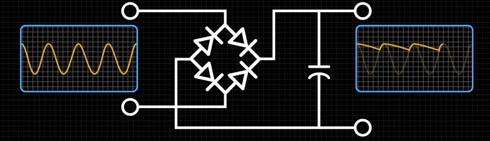

#### 铝电解电容

- 铝电解液电容（俗称：电解电容）
  - 便宜ESR大 寿命短（十年内）有漏液风险，适合低频滤波场景
- 铝高分子化合物电容（俗称：固态电容）
  - ESR小 寿命长 小贵 有一定要求的滤波场景

#### 坦电解电容

- 昂贵 容易过压爆炸 ESR小 热稳定性好 适合不差钱。对温度有要求

### 3.2 注意

- 电解电容都是有极性的，反接会爆炸💥

# 4 薄膜电容

大部分情况下以上两种 陶瓷电容和电解电容已经能够满足设计要求了，但是在**450V**以上的应用场景，就需要考虑薄膜电容了。

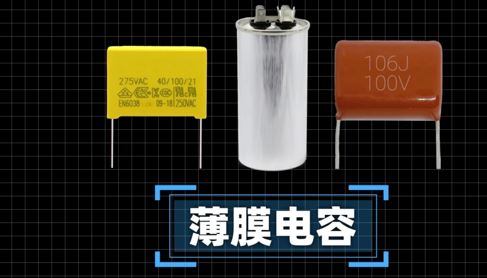

## 4.1 原理

将塑料薄膜作为电介质，金属箔作为电极

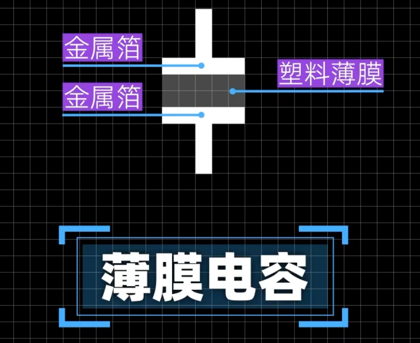

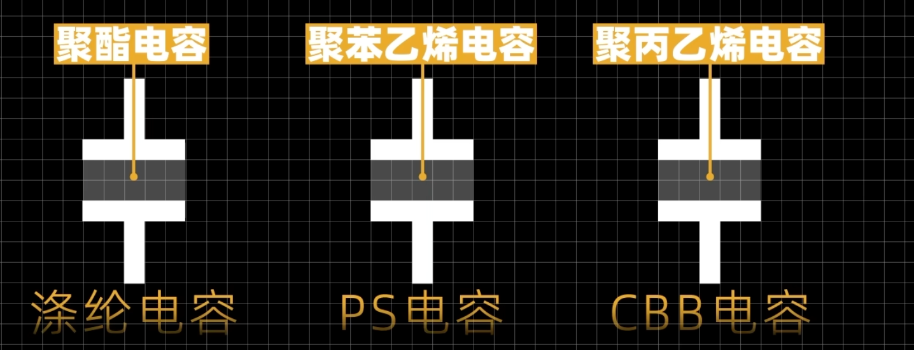

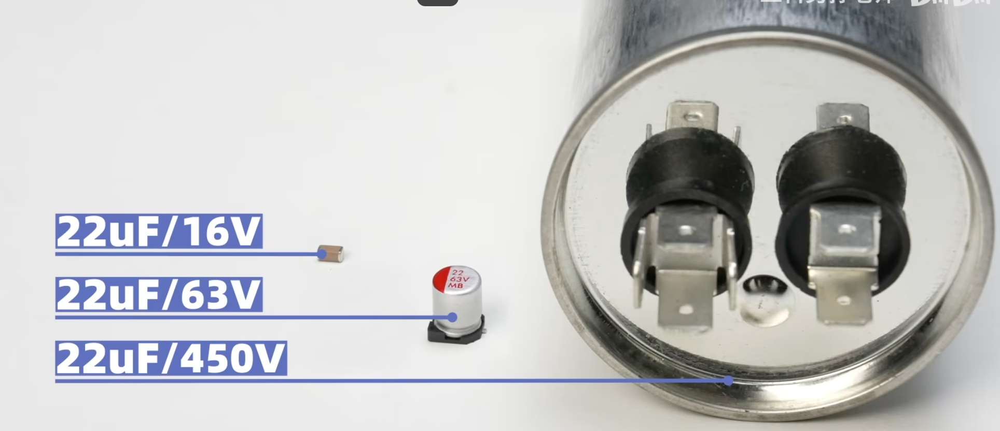

# 术语

## ESR

ESR = Equivalent Series Resistance，等效串联电阻

理想电容只有电容 C；**真实电容 = 理想 C + ESR（串联寄生电阻）+ ESL 等效串联电感**

来源：电极金属电阻、电解液、介质损耗、引脚电阻

单位：**mΩ（毫欧）**

影响：

1. 交流电流流过时产生发热损耗 \(P=I^2 \cdot ESR\)；
2. 增大电源纹波，降低滤波效果；
3. 开关电源、CPU 去耦强烈要求**低 ESR 电容**。

